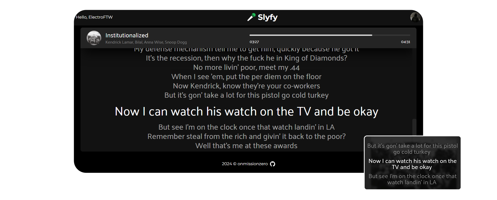

<p align="center">
    
</p>

<h1 align="center">Real-time Lyrics for Spotify</h1>

## Slyfy

A real-time, device-independent lyrics app for Spotify.



Enjoy synchronized lyrics displayed in real-time as you listen to your favorite tracks. Activate Picture-in-Picture mode for a seamless and convenient lyrics display while you enjoy your music.

The backend for this project can be found [here](https://github.com/onmissionzero/slyfy-backend/).

## Setup

Build the project: (Replace the env variables with yours)
```
npm install
cp example.env .env
```

Run the app:
```
npm run dev
```
## Disclaimer

This project is unofficial and is not associated with Spotify in any way.
